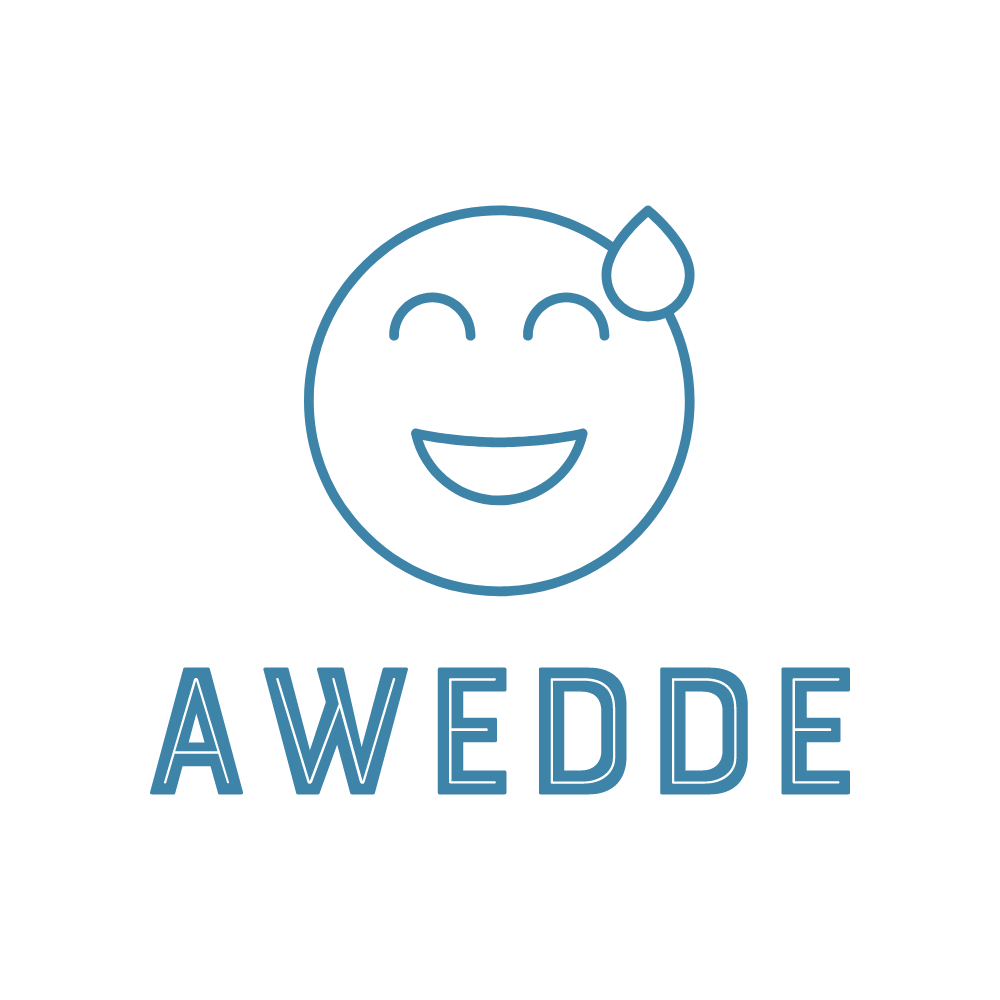

# Awedde - Version 1.0.0

[](https://github.com/ermi111/awedde/wiki)

<p align="center" style="border-radius: 20px;">
    
</p>


Awedde is a versatile collection of utility classes developed to simplify various tasks. It covers a wide range of functionalities, including DOM manipulation, form validation, media handling, network and security operations, and device detection; And other related tasks.

## Table of Contents

- [Introduction](#introduction)
- [Features](#features)
- [Getting Started](#getting-started)
- [Installation](#installation)
- [Usage](#usage)
- [Modules](#modules)
- [Contributing](#contributing)
- [License](#license)

## Introduction

Awedde is designed to be a comprehensive toolkit, offering utility classes for different aspects of web development. Whether you need to manipulate the DOM, validate forms, handle media, perform network operations, or detect devices, Awedde has you covered.

## Features

- **DOM Manipulation:** Simplify HTML document traversal and manipulation, including composites.
- **Form Validation:** Easily validate and handle form-related tasks.
- **Media Handling:** Streamline tasks related to media elements.
- **Network Operations:** Perform network-related tasks efficiently.
- **Device Detection:** Detect and handle device-specific tasks.

## Getting Started

To get started with Awedde, follow the steps below.

## Installation

```bash
npm install awedde
```

## Usage

```javascript

// Import the whole Awedde modules
import awedde from "awedde";

// Import Awedde modules as needed
import dom from "awedde";
import form from "awedde";
import media from "awedde";
import network from "awedde";
import device from "awedde";

// Use Awedde utility functions here
```
## Modules
Awedde is organized into the following modules:
dom: DOM manipulation utilities.
form: Form validation and related tasks.
media: Media handling utilities.
network: Network operations.
device: Device detection and device-related tasks.

Documentation is available inline with the code.

## Contributing
I (Ermiyas Arage) welcome contributions from the community. If you find any issues or have suggestions for improvements, feel free to open an issue or submit a pull request.

## License
This project is licensed under the Apache-2.0 - see the [LICENSE](LICENSE) file for details.

Thank you for choosing Awedde! I hope it simplifies your development tasks and relief stress. If you have any questions or feedback, please reach out to me through [Telegram](https://t.me/ermiyasarage).